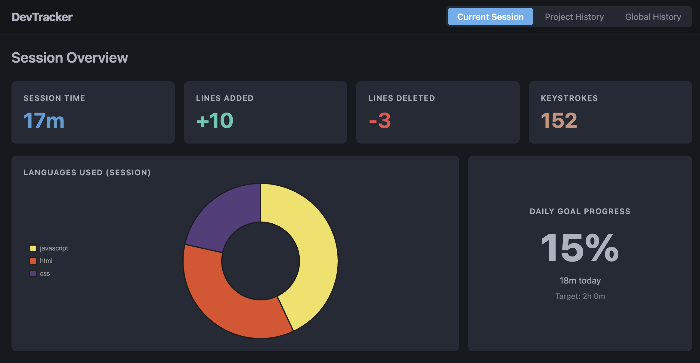
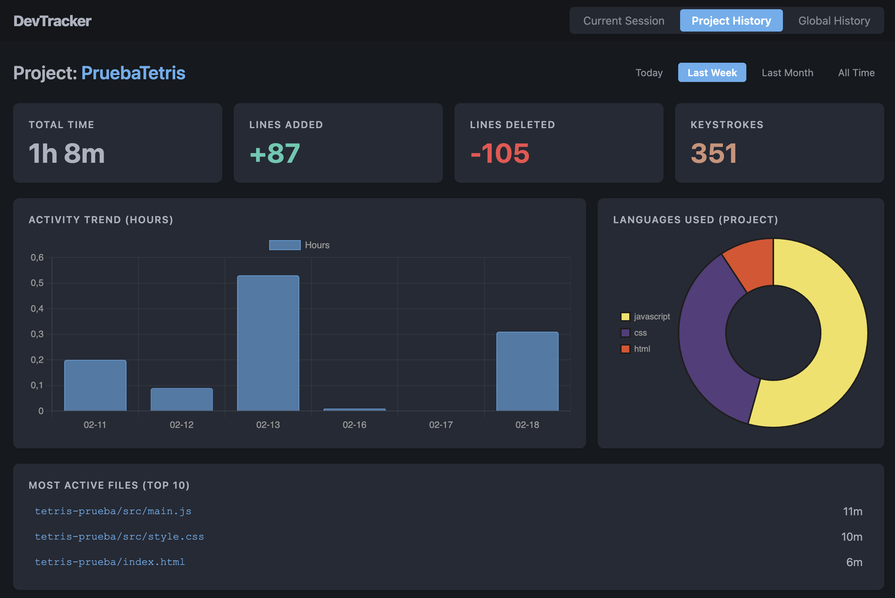

# DevTracker 📊

**DevTracker** is a professional analytics dashboard designed for developers who want to understand their coding habits, optimize their workflow, and stay motivated.

Unlike other tracking tools, **DevTracker works 100% locally**. Your coding data never leaves your machine.

## ✨ Key Features

### 1. ⏱️ Real-Time Analytics Dashboard

Visualize key metrics with a clean, professional design divided into four strategic views:

- **Today:** Your daily command center with active time, goal progress, focus score, current flow, edit volume, code churn, quality pressure, and Git context.
- **Project:** Analyze the evolution of your current project with range filters (Today, Last Week, Last Month, All Time).
- **Quality:** Track diagnostics, save rhythm, debug time, branch mix, and dirty files without leaving the IDE.
- **Global:** A complete overview of your "coding life" aggregating data across all your projects, including a weekly productivity heatmap.

### 2. 📈 Detailed Metrics

We don't just count time. DevTracker dives deep into your activity:

- **Active Time:** Smart timer that pauses automatically after inactivity.
- **Line Churn:** Differentiates between **Lines Added** (New Value), **Lines Deleted** (Refactoring), net change, and deletion ratio.
- **Edit Volume:** Measures changed characters and edit events, including large paste/import events.
- **Focus Score:** Estimates how concentrated your work is by combining active files and context switches.
- **Flow Blocks:** Tracks continuous blocks of activity and highlights the current and longest block.
- **Quality Pressure:** Captures VS Code diagnostics by severity for the active project.
- **Save Rhythm:** Shows saves per active hour to reveal working cadence.
- **Git Context:** Displays branch activity and dirty file counts when VS Code's built-in Git extension is available.
- **Languages & Files:** Shows language distribution and most active files with dense, scannable bars and tables.

### 3. 🎯 Gamification & Goals

- **Daily Goal Progress:** Set a daily hour target and visualize your progress in real-time.
- **Visual Feedback:** Semantic color indicators to evaluate your performance at a glance.

### 4. 🔒 Total Privacy & Data Freedom

- **100% Offline:** Your data is stored in a local JSON file in your user folder (`~/.devtracker/data.json`).
- **CSV Export:** Export your entire history to **CSV** with a single click to perform your own analysis in Excel, Python, or Notion.

---

## 🚀 How to Use

Once installed, DevTracker starts working automatically in the background.

### Available Commands

Open the Command Palette (`Ctrl+Shift+P` or `Cmd+Shift+P`) and type:

- `DevTracker: Open Dashboard`: Opens the main analytics panel.
- `DevTracker: Set Daily Goal`: Configures your daily hour target (Default: 4 hours).
- `DevTracker: Export Data (CSV)`: Generates a `.csv` file with your full history.

---

## 📸 Screenshots

### Session View

### Project History

---

## 🛡️ Privacy Policy

Your data is yours.

- **No Telemetry:** This extension does **NOT** send any data to external servers.
- **Local Storage:** All metrics are calculated and stored locally on your machine.

---

## 📝 License

This project is licensed under the [MIT License](LICENSE).

---

**Happy Coding!** 🚀
