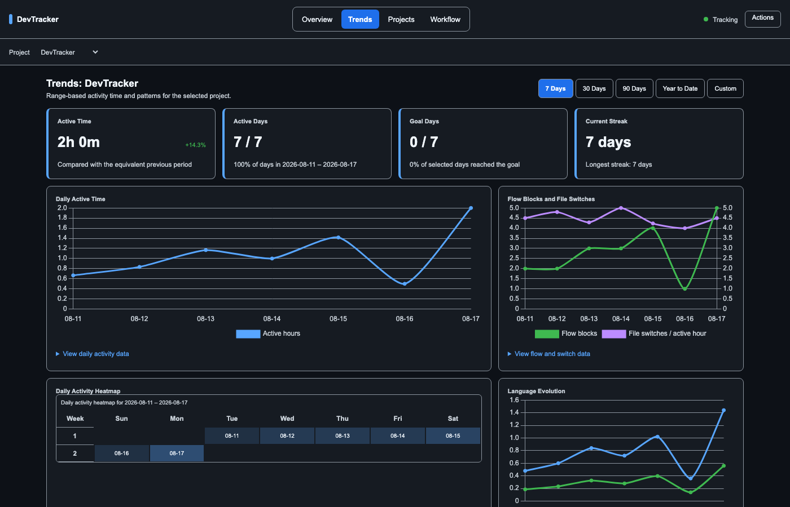
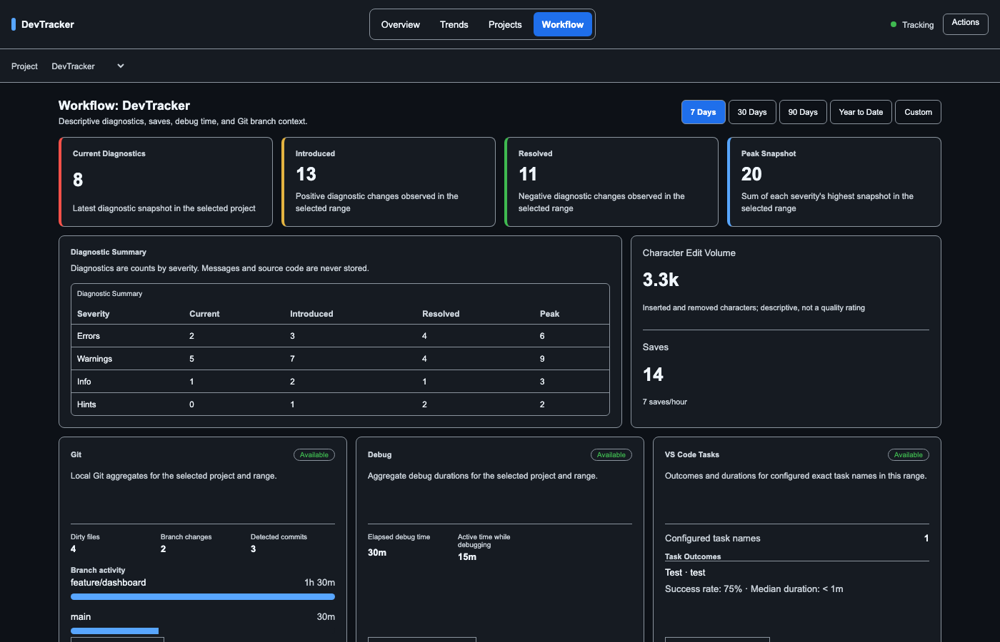

# DevTracker by Sergio

DevTracker is a local-first Visual Studio Code extension for reviewing your own editor activity over time. It reports descriptive observations—such as active time, edit events, flow continuity, diagnostics, and optional workflow signals—without assigning a productivity, quality, or performance score.

DevTracker has no telemetry, account, or hosted service. Collection, storage, queries, and dashboard rendering happen on your machine. Data leaves DevTracker only when you explicitly export it and decide what to do with the resulting local file.

## Dashboard

The dashboard has four keyboard-accessible views:

- **Overview** summarizes the selected range with active time, goal progress, tracking state, file concentration, flow continuity, edit volume, approximate line-break activity, diagnostics, and current Git context when enabled.
- **Trends** compares equivalent calendar periods and shows daily activity, active days, streaks, flow blocks, language distribution, and accessible table alternatives for every chart.
- **Projects** provides searchable and sortable project history, retained file and language detail, local aliases, and non-destructive archive or exclusion controls.
- **Workflow** separates editor observations from diagnostics and the independently optional Git, Debug, and VS Code Tasks integrations. Disabled, unavailable, setup, and no-data states are shown explicitly.

The interface follows VS Code theme tokens, supports light, dark, and high-contrast themes, adapts from narrow to wide layouts, honors reduced motion, and remains usable with keyboard navigation and zoom.

## What DevTracker measures

DevTracker names the source, unit, scope, precision class, formula, and unavailable state for every metric in the [metric contract](docs/metric-contract.md). The main groups are:

- **Time:** sampled active time, tracking state, debug elapsed time, and active time while debugging.
- **Editor activity:** edit and save events, inserted and removed UTF-16 code units, large-edit events, approximate inserted and removed line breaks, and active file time.
- **Continuity:** flow blocks, current and longest flow duration, and confirmed file or project switches.
- **Diagnostics:** current, introduced, resolved, and peak counts by severity. Diagnostic messages and source text are not stored.
- **Optional workflow context:** Git state and branch events, debug-session durations, and allowlisted build/test task outcomes.
- **Derived descriptions:** goal completion, active days, streaks, distributions, top-three file share, most active hour, rates per active hour, period changes, and four-week baselines.

Active time is a monotonic duration sampled from meaningful editor interactions. It stops when tracking is paused, the VS Code window loses focus, the current context is excluded, or five minutes pass without another accepted interaction. It is not proof that every included second involved typing or deliberate work.

Approximate line activity comes from editor change payloads. It is not a Git diff, code churn, value created, or refactoring. Larger numbers are not treated as better or worse.

## Privacy and control

Core editor activity is stored locally. Git, Debug, and VS Code Tasks tracking are separate opt-ins and are disabled by default.

You can:

- Pause and resume all tracking.
- Exclude projects or project-relative document paths with globs.
- Store relative document identities, profile-salted hashes, or no document detail.
- Retain completed session detail for a configurable number of days while preserving daily aggregate rollups.
- Open the exact data folder, create a complete backup before reset, and export only when requested.

The [privacy, storage, and exports guide](docs/privacy-and-data.md) documents defaults, collected fields, exclusions, retention, optional integrations, export contents, and the information DevTracker deliberately does not inspect.

## Commands

Open the Command Palette (`Cmd+Shift+P` on macOS or `Ctrl+Shift+P` on Windows and Linux) and run:

- `DevTracker: Open Dashboard`
- `DevTracker: Set Daily Goal`
- `DevTracker: Set or Clear Weekly Goal`
- `DevTracker: Export Data (JSON)`
- `DevTracker: Export Daily Summary (CSV)`
- `DevTracker: Pause Tracking`
- `DevTracker: Resume Tracking`
- `DevTracker: Open Data Folder`
- `DevTracker: Back Up and Reset Data`

## Settings

| Setting | Default | Effect |
| --- | --- | --- |
| `devtracker.projectExclusionGlobs` | `[]` | Excludes matching absolute project paths from all collection. |
| `devtracker.documentExclusionGlobs` | `[]` | Excludes matching project-relative documents from all collection. |
| `devtracker.detailedDataRetentionDays` | `30` | Retains completed session detail for this many days; aggregate daily rollups remain. |
| `devtracker.fileIdentityMode` | `relative` | Uses project-relative document identities. Choose `hashed` or `none` for less detail. |
| `devtracker.gitTrackingEnabled` | `false` | Enables local Git branch and repository-state aggregates. |
| `devtracker.debugTrackingEnabled` | `false` | Enables aggregate debug elapsed and active-time tracking. |
| `devtracker.taskTrackingEnabled` | `false` | Enables tracking for explicitly allowlisted VS Code Tasks. |
| `devtracker.trackedTasks` | `[]` | Exact task-name allowlist with a `build` or `test` classification. |

## Screenshots

### Overview

### Trends

### Projects

### Workflow

## Documentation

- [Metric contract](docs/metric-contract.md)
- [Privacy, storage, and exports](docs/privacy-and-data.md)
- [Storage schema and migration](docs/storage-v2.md)
- [Dashboard accessibility](docs/dashboard-accessibility.md)
- [Overview architecture](docs/architecture.md)
- [Trends view](docs/dashboard-trends.md)
- [Projects view](docs/dashboard-projects.md)
- [Workflow view](docs/dashboard-workflow.md)
- [Git tracking](docs/git-tracking.md)
- [Debug tracking](docs/debug-tracking.md)
- [VS Code Tasks tracking](docs/task-tracking.md)
- [Validation and CI](docs/validation.md)

## License

DevTracker is available under the [MIT License](LICENSE). Third-party notices are listed in [THIRD_PARTY_LICENSES.txt](THIRD_PARTY_LICENSES.txt).
