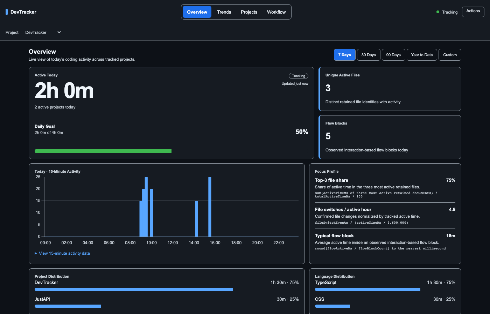
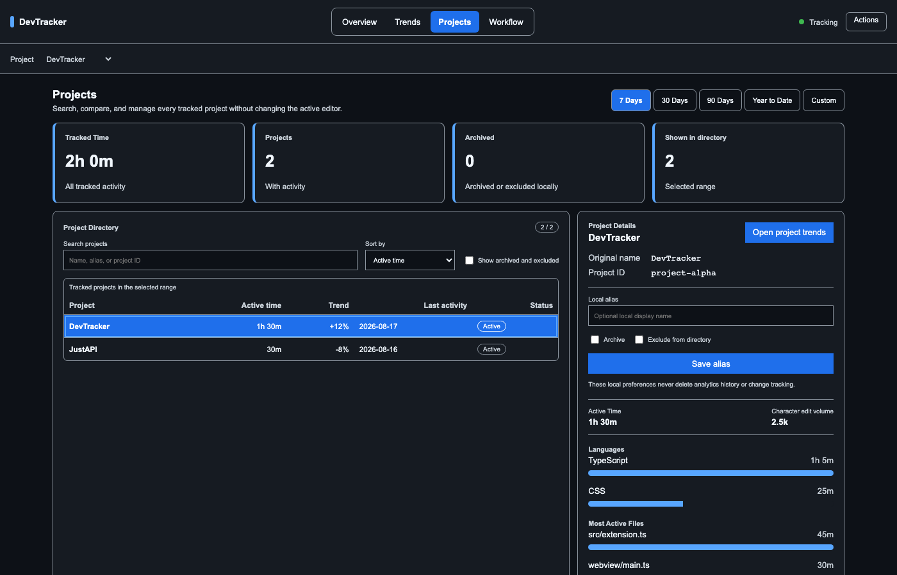

# DevTracker 📊

**DevTracker** is a local analytics dashboard for developers who want to understand their editor activity and review their work patterns over time.

Unlike other tracking tools, **DevTracker works 100% locally**. Your coding data never leaves your machine.

## ✨ Key Features

### 1. ⏱️ Real-Time Analytics Dashboard

Visualize descriptive activity metrics in four views:

- **Today:** Review active time, goal progress, activity concentration, current flow, character edit volume, approximate line activity, diagnostics, and Git context.
- **Trends:** Analyze a selected project's daily activity, consistency, flow, and language evolution with preset or custom calendar ranges.
- **Workflow:** Review current, introduced, resolved, and peak diagnostics alongside descriptive edit/save activity, then inspect independently opt-in Git, Debug, and configured Task outcomes with explicit disabled, unavailable, setup, and no-data states.
- **Projects:** Search and sort every historical project, inspect retained files, languages, and edit volume, and manage local aliases or archive/exclude preferences without deleting history.

### 2. 📈 Detailed Metrics

DevTracker describes observed editor activity without rating productivity, code quality, or developer performance:

- **Active Time:** A sampled duration that stops after five minutes without an observed interaction.
- **Approximate Line Activity:** Counts inserted and removed line breaks from editor changes; it is not a Git diff or a measure of value or refactoring.
- **Character Edit Volume:** Measures changed UTF-16 code units and edit events, including events classified as large by a size heuristic.
- **Top-3 File Share:** Shows how much tracked time belongs to the three most active files as a descriptive concentration metric.
- **Flow Blocks:** Groups continuous observed activity using a two-minute gap; it is not a psychological assessment.
- **Diagnostics Snapshot:** Shows VS Code diagnostics by severity without interpreting them as code quality.
- **Save Rhythm:** Shows saves per active hour to reveal working cadence.
- **Git Context:** Displays branch activity and dirty file counts only after the Git integration is enabled.
- **Languages & Files:** Shows language distribution and most active files with dense, scannable bars and tables.

The [DevTracker v2 metric contract](docs/metric-contract.md) documents every name, unit, source, scope, precision rule, legacy approximation, formula, and zero-data behavior. The [dashboard accessibility guide](docs/dashboard-accessibility.md) documents keyboard navigation, table alternatives, theme behavior, zoom, and reduced-motion support. The [Workflow dashboard guide](docs/dashboard-workflow.md) explains its descriptive metrics, integration states, and opt-in controls. The [Git tracking guide](docs/git-tracking.md) explains the opt-in repository integration and stored fields. The [architecture boundaries](docs/architecture.md) define how tracking, storage, queries, integrations, and presentation remain separated, and the [schema v2 storage guide](docs/storage-v2.md) defines the versioned local layout.

The [Extension Host integration testing guide](docs/integration-testing.md) documents the isolated real-VS Code lifecycle and event suite used to validate activation, tracking, optional integrations, and shutdown persistence. The [Trends dashboard guide](docs/dashboard-trends.md) explains ranges, fair comparisons, streaks, language evolution, accessible tables, and the view's privacy boundary. The [Projects dashboard guide](docs/dashboard-projects.md) documents project discovery, trend semantics, local preferences, and non-destructive history management.

### 3. 🎯 Gamification & Goals

- **Daily and Weekly Goals:** Keep the daily target and optionally configure a calendar-week target. Completion is shown descriptively and capped at 100%.
- **Visual Feedback:** Semantic color indicators show goal completion and metric state at a glance.

### 4. 🔒 Total Privacy & Data Freedom

- **100% Offline:** Current data is stored under VS Code's private extension storage. A legacy `~/.devtracker/data.json` file is read only for migration and is never replaced.
- **Data Export:** Export a selected range or complete retained history as versioned JSON, or generate a daily CSV summary with explicit units, a UTF-8 BOM, and spreadsheet-formula neutralization.
- **Collection controls:** Pause or resume tracking, exclude projects or documents with globs, choose relative, profile-salted hashed, or no file identity, and configure detailed-session retention.
- **Reversible reset:** Open the exact local data folder or create a complete local backup before resetting extension data.

---

## 🚀 How to Use

Once installed, DevTracker starts working automatically in the background.

### Available Commands

Open the Command Palette (`Ctrl+Shift+P` or `Cmd+Shift+P`) and type:

- `DevTracker: Open Dashboard`: Opens the main analytics panel.
- `DevTracker: Set Daily Goal`: Configures your daily hour target (Default: 4 hours).
- `DevTracker: Set or Clear Weekly Goal`: Configures an optional calendar-week target in minutes.
- `DevTracker: Export Data (JSON)`: Generates a versioned JSON export for a selected range or all retained history.
- `DevTracker: Export Daily Summary (CSV)`: Generates a safe day-level summary. The legacy `devtracker.exportCSV` command ID remains compatible.
- `DevTracker: Pause Tracking` / `DevTracker: Resume Tracking`: Explicitly control activity collection.
- `DevTracker: Open Data Folder`: Opens the current VS Code extension-storage folder.
- `DevTracker: Back Up and Reset Data`: Requires confirmation, creates a complete timestamped backup, resets active data, and reloads VS Code.

### Privacy settings

- `devtracker.projectExclusionGlobs` and `devtracker.documentExclusionGlobs`: Paths matching these globs contribute no tracking data.
- `devtracker.detailedDataRetentionDays`: Retains completed session detail for 30 days by default; aggregate daily rollups remain available.
- `devtracker.fileIdentityMode`: Stores project-relative identities by default, profile-salted hashes in `hashed` mode, or no document detail in `none` mode.
- `devtracker.gitTrackingEnabled`, `devtracker.debugTrackingEnabled`, and `devtracker.taskTrackingEnabled`: Independent opt-ins that are all disabled by default.
- `devtracker.trackedTasks`: Exact task-name allowlist with an explicit `build` or `test` classification. See [VS Code Tasks tracking](docs/task-tracking.md).

---

## 📸 Screenshots

### Session View

### Project History

---

## 🛡️ Privacy Policy

Your data is yours.

- **No Telemetry:** This extension does **NOT** send any data to external servers.
- **Local Storage:** All metrics are calculated and stored locally on your machine.
- **Data minimization:** Diagnostics persist counts and timestamps only—never messages, source content, terminal content, commands, or launch configurations.

---

## 📝 License

This project is licensed under the [MIT License](LICENSE).

---

**Happy Coding!** 🚀
